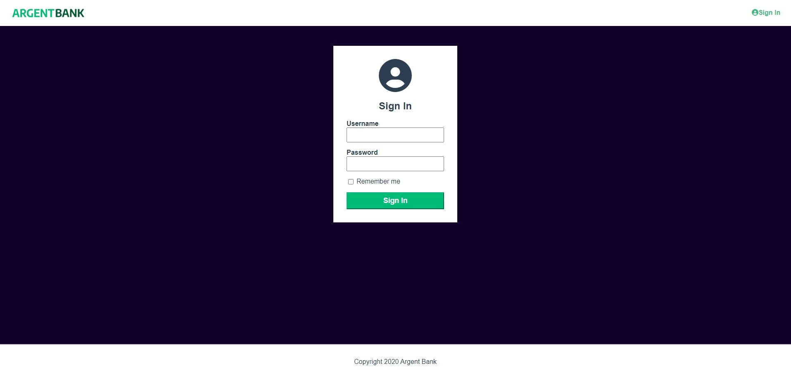

<a id="readme-top"></a>

# ArgentBank



## Description

A banking application made with React and ReduxToolKit as part of my OpenClassrooms training. API is documented with
Swagger and MongoDB is used for backend.

## Prerequisite

You also have to run the backend from this [repository](https://github.com/mrtinber/Project-10-Bank-API).

## Installation

First fork the project:

```bash
git clone https://github.com/mrtinber/P12-ArgentBank.git
cd P12-ArgentBank
```

Then run npm install:

```bash
npm install
```

And then run live server:

```bash
npm run dev
```

You should be able to view the project at http://localhost:5173

## Technologies used

![React][React.js]
![Vite][Vite]
![TypeScript][TypeScript]
![ReactRouter][ReactRouter]
![Redux][Redux]
![Sass][Sass]

## Author

[![GitHub][GitHub]][GitHub-URL]
[![LinkedIn][LinkedIn]][LinkedIn-URL]

## Contributing

Pull requests are welcome. For major changes, please open an issue first
to discuss what you would like to change.

Please make sure to update tests as appropriate.

<p align="right">(<a href="#readme-top">back to top</a>)</p>

<!-- MARKDOWN LINKS & IMAGES -->
[React.js]: https://img.shields.io/badge/React-20232A?style=for-the-badge&logo=react&logoColor=61DAFB
[ReactRouter]: https://img.shields.io/badge/React_Router-CA4245?style=for-the-badge&logo=react-router&logoColor=white
[Sass]: https://img.shields.io/badge/Sass-CC6699?style=for-the-badge&logo=sass&logoColor=white
[Redux]: https://img.shields.io/badge/Redux-593D88?style=for-the-badge&logo=redux&logoColor=white
[Vite]: https://img.shields.io/badge/Vite-B73BFE?style=for-the-badge&logo=vite&logoColor=FFD62E
[TypeScript]: https://img.shields.io/badge/TypeScript-007ACC?style=for-the-badge&logo=typescript&logoColor=white
[GitHub]: https://img.shields.io/badge/GitHub-100000?style=for-the-badge&logo=github&logoColor=white
[GitHub-URL]: https://github.com/mrtinber
[LinkedIn]: https://img.shields.io/badge/LinkedIn-0077B5?style=for-the-badge&logo=linkedin&logoColor=white
[LinkedIn-URL]: https://www.linkedin.com/in/kevin-bertin/